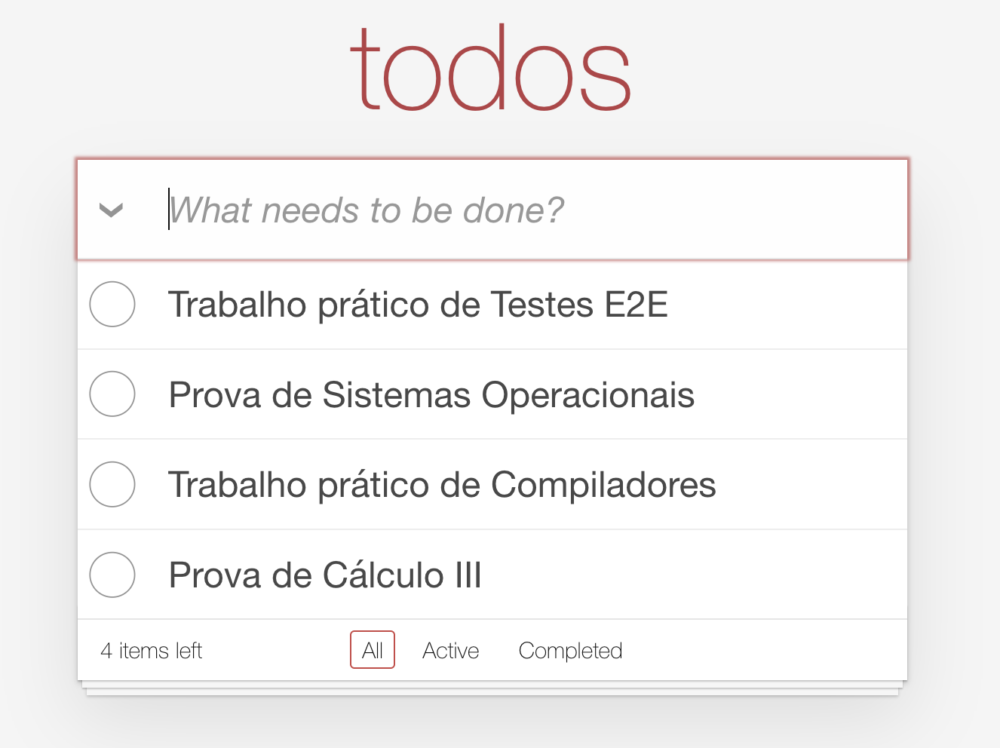

# Roteiro de Testes E2E Usando Cypress

## Aplicação Alvo

Neste roteiro vamos testar uma aplicação simples de criação de lista de tarefas, chamada TodoMVC, cujo repositório se encontra [aqui](https://github.com/tastejs/todomvc).

Para facilitar, copiamos o código dessa aplicação, especificamente a implementação baseada em JavaScript ES5, para este diretório. Ou seja, com isso, você vai fazer o roteiro integralmente neste repositório. Basta, primeiro, cloná-lo para sua máquina local.

Depois disso, digite em um terminal aberto no diretório clonado:

```
npm install
npm run build
npm run dev
```

Em um browser, digite:

```
http://localhost:7001
```

Então, use a aplicação e experimente as suas features. Segue um screenshot de exemplo após o cadastro de algumas tarefas.




## Rodando o Primeiro Teste E2E

Em um novo terminal, abra a interface gráfica do Cypress, digitando na raiz do seu diretório:

```
npx cypress open
```

Então escolha: "E2E Testing", "Chrome" e "Start E2E Testing in Chrome".

Depois, abra um teste que já implementamos, clicando no arquivo chamado `spec.cy.js`. O teste será aberto pelo Cypress e será automaticamente executado. Isso ocorre em uma nova janela do Chrome que também foi aberta automaticamente pelo Cypress.

Estude esse primeiro teste, que está no diretório local `cypress\e2e`(ou clique [aqui](https://github.com/mtov/roteiro-cypress/blob/main/cypress/e2e/spec.cy.js))

Observação: se quiser, você pode rodar os testes também via linha de comando:

```bash
npx cypress run
```

## Exercício

Implemente mais três testes (isto é, comandos `it`) no arquivo `cypress\e2e\spec.cy.js`
